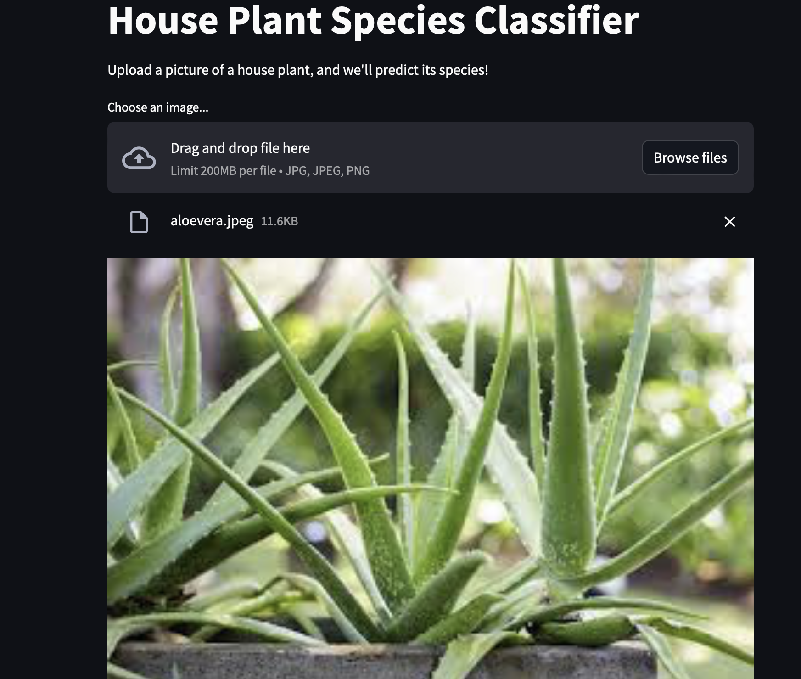

# 🌿 Plant Species Prediction App

This is a simple web application built with **Streamlit** that predicts the species of a plant using a trained deep learning model (`best_model.h5`) built with **TensorFlow**.

---

##  Demo 


---

## How It Works

1. The app loads a trained TensorFlow model (`best_model.h5`).
2. You upload an image of a plant.
3. The model processes the image and predicts its species.

---

## Technologies Used

- **Python 3.10**
- **Streamlit**
- **TensorFlow / Keras**
- **h5py**

---

## How to Run the App Locally

### 1. Clone the repository

```bash
git clone https://github.com/yourusername/plant_species_prediction.git
cd plant_species_prediction
```
### 2. Create and activate a virtual environment (recommended)

```bash
python3.10 -m venv venv
source venv/bin/activate  # On Windows: venv\Scripts\activate
```
### 3. Install the required packages
```bash
pip install -r requirements.txt
```

4. Run the app
 ```bash
streamlit run my_project/myapp.py
```

## Project Structure
 ```bash
plant_species_prediction/
│
├── my_project/
│   ├── myapp.py              # Streamlit app
│   └── best_model.h5         # Trained TensorFlow model
│
├── requirements.txt          # Python dependencies
└── README.md                 # Project documentation
```


